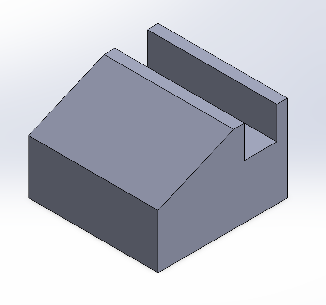
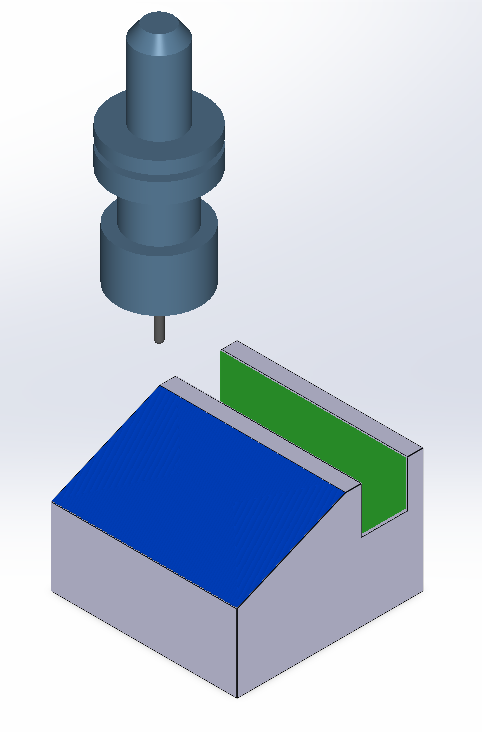
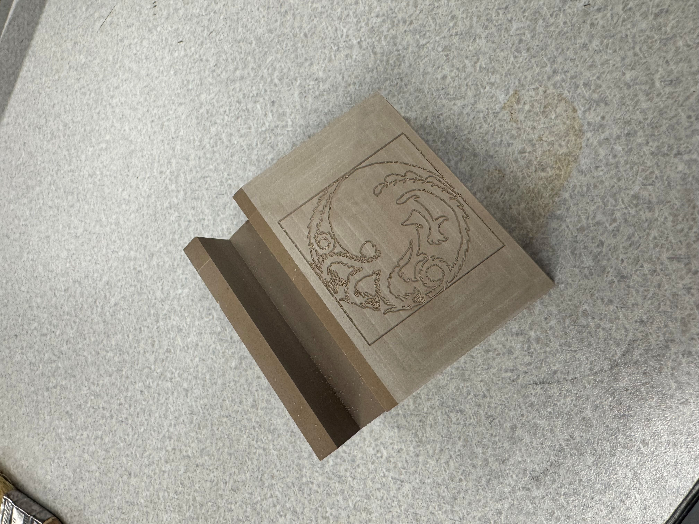

# Phone Holder CAD to Manufacturing
This project demonstrates the full pipeline of creating a phone holder from a hand-drawn image to CAD modeling and manufacturing, using MATLAB, SolidWorks, and CNC tools.

It includes:
- Image vectorization and conversion to DXF format using MATLAB
- SolidWorks part design based on DXF profiles
- Toolpath generation and G-code creation for CNC manufacturing
- Setup sheet documentation for the CNC process

## Author
Serge Alhalbi

## Company
The Ohio State University

## Collaborators
- Neil Gardner

## Tools and Libraries
- SolidWorks
- CNC
- MATLAB

## Usage
```bash
git clone https://github.com/SergeAlhalbi/phone-holder-cad-to-manufacturing.git
cd phone-holder-cad-to-manufacturing
```

## Results
Below are the results:

- **Targaryen Sigil**:
  
  

- **Design**:
  
  

- **Simulation**:
  
  

- **Part**:

  
